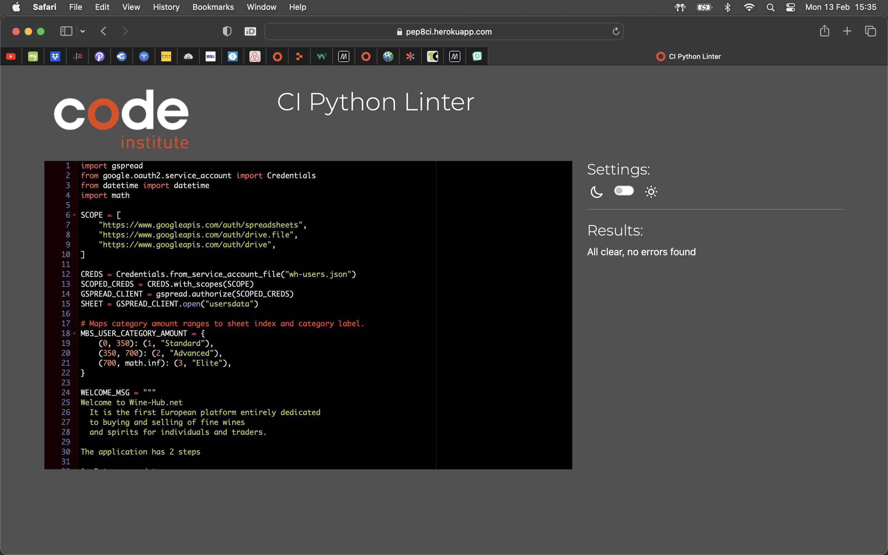

# Wine-Hub
### It is the first European platform entirely dedicated to buying and selling of fine wines and spirits for individuals and traders.

* The file that contains my code is called `run.py`
* The spreadsheet that is connected to is called `usersdata`
* The Heroku link is https://wine-hub.herokuapp.com/
* The application has two steps:
    - Enter your data.
    - Calculate the best membership (MBS) plan for you
    which can be:
   - `Standard` for small businesses.
   - `Advance` for medium businesses.
   - `Elite` for wine brokers and large businesses.

# How it works..
 It requires some general data to start, such as: 'name, date of birth, you recidence, amout you spent on a week, a category of spirits or wines and the grape varieties.

Once the user insert all the data we will calculate the best MBS for the users.
MBS stands for membership plan.
The data that we are going to target is the weekly outcome , so called "Amount" on the spreadsheet.

After the users insert the amount it will be calculated in our MBS and depending of it will give the best plan for the users.

The MBS is divided in three slots
- `Standard` to all the users with an out come between 0 and 350 €/£.
- `Advance`  to all the users with an out come between 351 to 700 €/£.
- `Elite`  to all the users than have an out come bigger that 701 €/ £ per week.

# To the App.
 This is the firt part of the project where is explained the steps to follow.

  -- 

After it has been reed it, the can proceed this the application.

--  

Then, we will extract the amout used and calculate the MBS,
in this case the customer as been elected for an Elite MBS.

-- 

## Future Features

* Allow users to compare the different MBS.
* Allow users to insert only the name and surmane to get to their data, after being registered.
* Have more info regarding the MBS.
* Implement a bigger explanation to the MBS.

## Testing

I have manually tested this proiect by doing the following

- Passed the code through  a PEP8 linter and confirmed there are no problems

- Given invalid inouts: strinas when numbers are expected out of bounds inouts. same inbut twice

- Tested in my local terminal and the Code Institute Heroku terminal.

## Bugs

  Solved Bugs

- When I started the project I had some issue to make the python format, adding to much space through the function and loop, then I realised that issus and fix it removing the extra spaces.

- My validation for the function calculate_mbs_usr_amount were wrong becuse I couldn’t not be able to extrac the data that it was needed.

    
       The way i resolved my issue was just adding the
        `(data[0], data[3])`
        to the terminal and it worked.

 ### Remaining Bugs
  * No bugs remaining       

## Validator Testing
  - PEP8
      -  No errors were returned from PEPSonline com

      

## Deployment

This project was deployed using Code institute's mock terminal for Heroku.

* Steps for deployment:
  - Fork or clone this repository
  - Create a new Heroku app
  - Set buildbacks to `Python` and `NodeJS` in that order
  - Link Heroku app to the repository
  - Click on Deploy

  # Credits
   * Code Institute for the deployment terminal